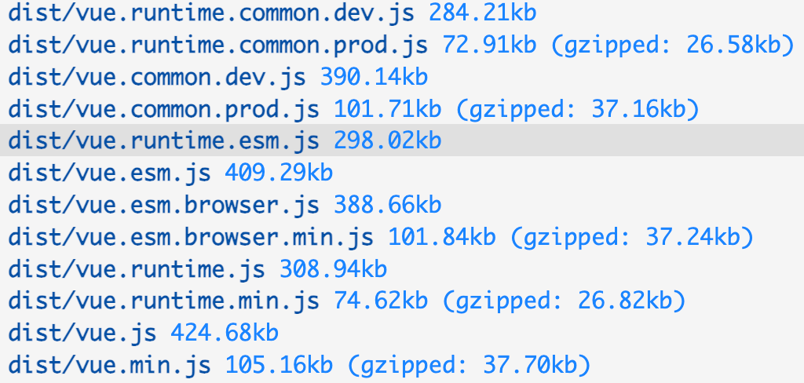

平时我们使用的vue是打包后的资源文件，是使用rollup进行构建的，一般node项目会有一个package.json文件，通常会配置script字段作为NPM的执行脚本，Vue.js源码构建的脚本如下：

```js
{
 "scripts": { 
    "build": "node scripts/build.js",
    "build:ssr": "npm run build -- runtime-cjs,server-renderer",
    "build:types": "rimraf temp && tsc --declaration --emitDeclarationOnly --outDir temp && api-extractor run && api-extractor  
  }
}
```

#  build  vs  build:ssr  vs  build:types

1. build 脚本：

    * build 脚本用于构建 Vue.js 的通用构建文件，主要包括运行时构建（runtime-only）和运行时+编译器构建（runtime+compiler）。
    * 运行时构建适用于大多数情况，将模板编译成渲染函数，并不包含模板编译器。
    * 运行时+编译器构建则包含模板编译器，适用于需要在客户端编译模板的情况，例如使用 template 选项或单文件组件。
    * build 脚本通常用于构建 Vue.js 的生产版本，用于在浏览器中运行。

2. build:ssr 脚本：

    * build:ssr 脚本用于构建 Vue.js 的服务端渲染（SSR）版本。
    * 服务端渲染版本的 Vue.js 可以在服务器端执行 Vue 组件的渲染，生成首次加载时的完整 HTML，有利于 SEO 和首屏加载性能。
    * build:ssr 脚本会生成用于服务端渲染的相关文件和代码。

3. build:types 脚本：

    * build:types 脚本用于生成 TypeScript 类型声明文件。
    * TypeScript 类型声明文件定义了 Vue.js 框架中各种对象、接口、函数等的类型信息，帮助 TypeScript 编译器理解和检查代码。
    * 通过运行 build:types 脚本，可以生成用于 TypeScript 开发的类型声明文件。

总的来说，build 脚本用于构建通用版本的 Vue.js，build:ssr 脚本用于构建服务端渲染版本的 Vue.js，而 build:types 脚本用于生成 TypeScript 类型声明文件。根据需要，您可以选择运行不同的构建脚本来生成不同类型的输出文件。

# 执行npm run build

npm run build 可以打包出多种环境下的包，我们可以试着研究一下build脚本的打包流程。

## 1.先判断打包目录是否为空

```js 
//查看指定目录下是否有dist目录
if (!fs.existsSync('dist')) {
    //如果没有dist目录则创建一个dist目录
    fs.mkdirSync('dist')
}
```

## 2.获取打包配置

```js
let builds = require('./config').getAllBuilds()

//config内容
exports.getAllBuilds = () => Object.keys(builds).map(genConfig)

//build变量
const builds = {
  // Runtime only (CommonJS). Used by bundlers e.g. Webpack & Browserify
  'runtime-cjs-dev': {
    entry: resolve('web/entry-runtime.ts'),
    dest: resolve('dist/vue.runtime.common.dev.js'),
    format: 'cjs',
    env: 'development',
    banner
  },
  'runtime-cjs-prod': {
    entry: resolve('web/entry-runtime.ts'),
    dest: resolve('dist/vue.runtime.common.prod.js'),
    format: 'cjs',
    env: 'production',
    banner
  },
  // Runtime+compiler CommonJS build (CommonJS)
  'full-cjs-dev': {
    entry: resolve('web/entry-runtime-with-compiler.ts'),
    dest: resolve('dist/vue.common.dev.js'),
    format: 'cjs',
    env: 'development',
    alias: { he: './entity-decoder' },
    banner
  },
  'full-cjs-prod': {
    entry: resolve('web/entry-runtime-with-compiler.ts'),
    dest: resolve('dist/vue.common.prod.js'),
    format: 'cjs',
    env: 'production',
    alias: { he: './entity-decoder' },
    banner
  },
  // Runtime only ES modules build (for bundlers)
  'runtime-esm': {
    entry: resolve('web/entry-runtime-esm.ts'),
    dest: resolve('dist/vue.runtime.esm.js'),
    format: 'es',
    banner
  },
  // Runtime+compiler ES modules build (for bundlers)
  'full-esm': {
    entry: resolve('web/entry-runtime-with-compiler-esm.ts'),
    dest: resolve('dist/vue.esm.js'),
    format: 'es',
    alias: { he: './entity-decoder' },
    banner
  },
  // Runtime+compiler ES modules build (for direct import in browser)
  'full-esm-browser-dev': {
    entry: resolve('web/entry-runtime-with-compiler-esm.ts'),
    dest: resolve('dist/vue.esm.browser.js'),
    format: 'es',
    transpile: false,
    env: 'development',
    alias: { he: './entity-decoder' },
    banner
  },
  // Runtime+compiler ES modules build (for direct import in browser)
  'full-esm-browser-prod': {
    entry: resolve('web/entry-runtime-with-compiler-esm.ts'),
    dest: resolve('dist/vue.esm.browser.min.js'),
    format: 'es',
    transpile: false,
    env: 'production',
    alias: { he: './entity-decoder' },
    banner
  },
  // runtime-only build (Browser)
  'runtime-dev': {
    entry: resolve('web/entry-runtime.ts'),
    dest: resolve('dist/vue.runtime.js'),
    format: 'umd',
    env: 'development',
    banner
  },
  // runtime-only production build (Browser)
  'runtime-prod': {
    entry: resolve('web/entry-runtime.ts'),
    dest: resolve('dist/vue.runtime.min.js'),
    format: 'umd',
    env: 'production',
    banner
  },
  // Runtime+compiler development build (Browser)
  'full-dev': {
    entry: resolve('web/entry-runtime-with-compiler.ts'),
    dest: resolve('dist/vue.js'),
    format: 'umd',
    env: 'development',
    alias: { he: './entity-decoder' },
    banner
  },
  // Runtime+compiler production build  (Browser)
  'full-prod': {
    entry: resolve('web/entry-runtime-with-compiler.ts'),
    dest: resolve('dist/vue.min.js'),
    format: 'umd',
    env: 'production',
    alias: { he: './entity-decoder' },
    banner
  },
  // Web compiler (CommonJS).
  compiler: {
    entry: resolve('web/entry-compiler.ts'),
    dest: resolve('packages/template-compiler/build.js'),
    format: 'cjs',
    external: Object.keys(
      require('../packages/template-compiler/package.json').dependencies
    )
  },
  // Web compiler (UMD for in-browser use).
  'compiler-browser': {
    entry: resolve('web/entry-compiler.ts'),
    dest: resolve('packages/template-compiler/browser.js'),
    format: 'umd',
    env: 'development',
    moduleName: 'VueTemplateCompiler',
    plugins: [node(), cjs()]
  },
  // Web server renderer (CommonJS).
  'server-renderer-dev': {
    entry: resolve('packages/server-renderer/src/index.ts'),
    dest: resolve('packages/server-renderer/build.dev.js'),
    format: 'cjs',
    env: 'development',
    external: [
      'stream',
      ...Object.keys(
        require('../packages/server-renderer/package.json').dependencies
      )
    ]
  },
  'server-renderer-prod': {
    entry: resolve('server/index.ts'),
    dest: resolve('packages/server-renderer/build.prod.js'),
    format: 'cjs',
    env: 'production',
    external: [
      'stream',
      ...Object.keys(
        require('../packages/server-renderer/package.json').dependencies
      )
    ]
  },
  'server-renderer-basic': {
    entry: resolve('server/index-basic.ts'),
    dest: resolve('packages/server-renderer/basic.js'),
    format: 'umd',
    env: 'development',
    moduleName: 'renderVueComponentToString',
    plugins: [node(), cjs()]
  },
  'server-renderer-webpack-server-plugin': {
    entry: resolve('server/webpack-plugin/server.ts'),
    dest: resolve('packages/server-renderer/server-plugin.js'),
    format: 'cjs',
    external: Object.keys(
      require('../packages/server-renderer/package.json').dependencies
    )
  },
  'server-renderer-webpack-client-plugin': {
    entry: resolve('server/webpack-plugin/client.ts'),
    dest: resolve('packages/server-renderer/client-plugin.js'),
    format: 'cjs',
    external: Object.keys(
      require('../packages/server-renderer/package.json').dependencies
    )
  },
  'compiler-sfc': {
    entry: resolve('packages/compiler-sfc/src/index.ts'),
    dest: resolve('packages/compiler-sfc/dist/compiler-sfc.js'),
    format: 'cjs',
    external: Object.keys(
      require('../packages/compiler-sfc/package.json').dependencies
    ),
    plugins: [
      node({ preferBuiltins: true }),
      cjs({
        ignore: [
          ...Object.keys(require(consolidatePath).devDependencies),
          'vm',
          'crypto',
          'react-dom/server',
          'teacup/lib/express',
          'arc-templates/dist/es5',
          'then-pug',
          'then-jade'
        ]
      })
    ]
  }
}

// genConfig方法
function genConfig(name) {
  const opts = builds[name]
  const isTargetingBrowser = !(
    opts.transpile === false || opts.format === 'cjs'
  )

  // console.log('__dir', __dirname)
  const config = {
    input: opts.entry,
    external: opts.external,
    plugins: [
      alias({
        entries: Object.assign({}, aliases, opts.alias)
      }),
      ts({
        tsconfig: path.resolve(__dirname, '../', 'tsconfig.json'),
        cacheRoot: path.resolve(__dirname, '../', 'node_modules/.rts2_cache'),
        tsconfigOverride: {
          compilerOptions: {
            // if targeting browser, target es5
            // if targeting node, es2017 means Node 8
            target: isTargetingBrowser ? 'es5' : 'es2017'
          },
          include: isTargetingBrowser ? ['src'] : ['src', 'packages/*/src'],
          exclude: ['test', 'test-dts']
        }
      })
    ].concat(opts.plugins || []),
    output: {
      file: opts.dest,
      format: opts.format,
      banner: opts.banner,
      name: opts.moduleName || 'Vue',
      exports: 'auto'
    },
    onwarn: (msg, warn) => {
      if (!/Circular/.test(msg)) {
        warn(msg)
      }
    }
  }

  // console.log('pluging', config.plugins)

  // built-in vars
  const vars = {
    __VERSION__: version,
    __DEV__: `process.env.NODE_ENV !== 'production'`,
    __TEST__: false,
    __GLOBAL__: opts.format === 'umd' || name.includes('browser')
  }
  // feature flags
  Object.keys(featureFlags).forEach(key => {
    vars[`process.env.${key}`] = featureFlags[key]
  })
  // build-specific env
  if (opts.env) {
    vars['process.env.NODE_ENV'] = JSON.stringify(opts.env)
    vars.__DEV__ = opts.env !== 'production'
  }

  vars.preventAssignment = true
  config.plugins.push(replace(vars))

  Object.defineProperty(config, '_name', {
    enumerable: false,
    value: name
  })

  return config
}

//过滤出指定环境下的配置
if (process.argv[2]) {
  const filters = process.argv[2].split(',')
  builds = builds.filter(b => {
    return filters.some(f => b.output.file.indexOf(f) > -1 || b._name.indexOf(f) > -1)
  })
}
```

先是获取到所有环境下的rollup打包配置，然后通过build后面的传参来筛选出指定环境下的配置

## 3.build进行打包

有了每一项的配置，直接通过rollup进行打包即可。

```js
build(builds)

function build (builds) {
  let built = 0
  const total = builds.length
  const next = () => {
    buildEntry(builds[built]).then(() => {
      built++
      if (built < total) {
        next()
      }
    }).catch(logError)
  }

  next()
}

function buildEntry (config) {
  const output = config.output
  const { file, banner } = output
  const isProd = /(min|prod)\.js$/.test(file)
  return rollup.rollup(config)
    .then(bundle => bundle.generate(output))
    .then(async ({ output: [{ code }] }) => {
      if (isProd) {
        const {code: minifiedCode} =  await terser.minify(code, {
          toplevel: true,
          compress: {
            pure_funcs: ['makeMap'],
          },
          format: {
            ascii_only: true,
          }
        });
        const minified = (banner ? banner + '\n' : '') + minifiedCode
        return write(file, minified, true)
      } else {
        return write(file, code)
      }
    })
}
```

## 打包输出结果


 