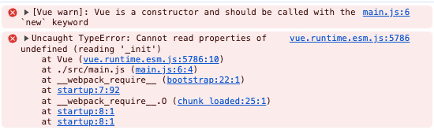

使用vue-create生成的项目中配置vue路径为:```vue/dist/vue.runtime.esm.js```

```js
//webpack配置
resolve: {
    alias: { 
      vue$: 'vue/dist/vue.runtime.esm.js'
    }
}
```

由上节内容我们知道vue.runtime.esm.js打包入口是src/platforms/web/entry-runtime-esm.ts

# 入口文件

从下可知Vue是从从runtime/index.ts导入的

```js
import Vue from './runtime/index'

export default Vue
```

# src/platform/runtime/index.ts文件

我们可以看到这里定义了$mount方法，Vue对象是从src/core/index.ts中导入的，我们一起看下core/index.ts文件是怎编写的。

```js
import Vue from 'core/index'
import config from 'core/config'
import { extend, noop } from 'shared/util'
import { mountComponent } from 'core/instance/lifecycle'
import { devtools, inBrowser } from 'core/util/index'

import {
  query,
  mustUseProp,
  isReservedTag,
  isReservedAttr,
  getTagNamespace,
  isUnknownElement
} from 'web/util/index'

import { patch } from './patch'
import platformDirectives from './directives/index'
import platformComponents from './components/index'
import type { Component } from 'types/component'

// install platform specific utils
Vue.config.mustUseProp = mustUseProp
Vue.config.isReservedTag = isReservedTag
Vue.config.isReservedAttr = isReservedAttr
Vue.config.getTagNamespace = getTagNamespace
Vue.config.isUnknownElement = isUnknownElement

// install platform runtime directives & components
extend(Vue.options.directives, platformDirectives)
extend(Vue.options.components, platformComponents)

// install platform patch function
Vue.prototype.__patch__ = inBrowser ? patch : noop

// public mount method
Vue.prototype.$mount = function (
  el?: string | Element,
  hydrating?: boolean
): Component {
  el = el && inBrowser ? query(el) : undefined
  return mountComponent(this, el, hydrating)
}

// devtools global hook
/* istanbul ignore next */
if (inBrowser) {
  setTimeout(() => {
    if (config.devtools) {
      if (devtools) {
        devtools.emit('init', Vue)
      } else if (__DEV__ && process.env.NODE_ENV !== 'test') {
        // @ts-expect-error
        console[console.info ? 'info' : 'log'](
          'Download the Vue Devtools extension for a better development experience:\n' +
            'https://github.com/vuejs/vue-devtools'
        )
      }
    }
    if (
      __DEV__ &&
      process.env.NODE_ENV !== 'test' &&
      config.productionTip !== false &&
      typeof console !== 'undefined'
    ) {
      // @ts-expect-error
      console[console.info ? 'info' : 'log'](
        `You are running Vue in development mode.\n` +
          `Make sure to turn on production mode when deploying for production.\n` +
          `See more tips at https://vuejs.org/guide/deployment.html`
      )
    }
  }, 0)
}

export default Vue
```

# src/core/index.ts文件

我们可以看到在Vue原型上定义了一些值，然后使用initGlobalAPI方法定义了一些东西，然后Vue对象是在instance目录下定义的，我们一起来看下

```js
import Vue from './instance/index'
import { initGlobalAPI } from './global-api/index'
import { isServerRendering } from 'core/util/env'
import { FunctionalRenderContext } from 'core/vdom/create-functional-component'
import { version } from 'v3'

initGlobalAPI(Vue)

Object.defineProperty(Vue.prototype, '$isServer', {
  get: isServerRendering
})

Object.defineProperty(Vue.prototype, '$ssrContext', {
  get() {
    /* istanbul ignore next */
    return this.$vnode && this.$vnode.ssrContext
  }
})

// expose FunctionalRenderContext for ssr runtime helper installation
Object.defineProperty(Vue, 'FunctionalRenderContext', {
  value: FunctionalRenderContext
})

Vue.version = version

export default Vue

```

# src/core/instance.ts文件

```js
import { initMixin } from './init'
import { stateMixin } from './state'
import { renderMixin } from './render'
import { eventsMixin } from './events'
import { lifecycleMixin } from './lifecycle'
import { warn } from '../util/index'
import type { GlobalAPI } from 'types/global-api'

function Vue(options) {
  if (__DEV__ && !(this instanceof Vue)) {
    warn('Vue is a constructor and should be called with the `new` keyword')
  }
  this._init(options)
}

//@ts-expect-error Vue has function type
initMixin(Vue)
//@ts-expect-error Vue has function type
stateMixin(Vue)
//@ts-expect-error Vue has function type
eventsMixin(Vue)
//@ts-expect-error Vue has function type
lifecycleMixin(Vue)
//@ts-expect-error Vue has function type
renderMixin(Vue)

export default Vue as unknown as GlobalAPI
```

# 定义Vue对象

这段代码是Vue.js的构造函数定义，主要用于创建Vue实例，让我们来分析一下这段代码：

```js
function Vue(options) {
  if (__DEV__ && !(this instanceof Vue)) {
    warn('Vue is a constructor and should be called with the `new` keyword')
  }
  this._init(options)
}
```

1. function Vue(options) { ... }: 定义了一个名为Vue的构造函数，接受一个名为options的参数。在Vue.js中，options 通常用于传递组件的配置信息。
2. if (__DEV__ && !(this instanceof Vue)) { ... }: 这里使用了一个条件判断，首先会判断是否处于开发环境（__DEV__ 变量的值为 true），然后再判断当前的 this 对象是否是 Vue 的实例。如果不是 Vue 的实例，并且处于开发环境下，则会通过 warn 函数输出警告信息，提示开发者应该使用 new 关键字来调用 Vue 构造函数。
3. this._init(options)：调用了 this._init 方法，该方法用于初始化 Vue 实例，传入 options 参数。在 _init 方法中，会进行 Vue 实例的初始化工作，包括数据响应式处理、事件处理、生命周期钩子等。

综合来看，这段代码展示了 Vue.js 的构造函数定义和初始化过程，以及对开发环境下的一些规范的提示。

举个例子：如果你在入口文件没有使用new来调用构造函数，控制台会报错：因为此时this为undefined，没有_init方法，所以会报错

```js
Vue({
  render: h => h(App),
}).$mount('#app')
```


# Vue.prototype._init方法

_init方法是在initMixin函数进行定义的，在core/instance/init.ts文件下

```js
export function initMixin(Vue: typeof Component) {
  Vue.prototype._init = function (options?: Record<string, any>) {
    const vm: Component = this
    // a uid
    vm._uid = uid++

    let startTag, endTag
    /* istanbul ignore if */
    if (__DEV__ && config.performance && mark) {
      startTag = `vue-perf-start:${vm._uid}`
      endTag = `vue-perf-end:${vm._uid}`
      mark(startTag)
    }

    // a flag to mark this as a Vue instance without having to do instanceof
    // check
    vm._isVue = true
    // avoid instances from being observed
    vm.__v_skip = true
    // effect scope
    vm._scope = new EffectScope(true /* detached */)
    // #13134 edge case where a child component is manually created during the
    // render of a parent component
    vm._scope.parent = undefined
    vm._scope._vm = true
    // merge options
    if (options && options._isComponent) {
      // optimize internal component instantiation
      // since dynamic options merging is pretty slow, and none of the
      // internal component options needs special treatment.
      initInternalComponent(vm, options as any)
    } else {
      vm.$options = mergeOptions(
        resolveConstructorOptions(vm.constructor as any),
        options || {},
        vm
      )
    }
    /* istanbul ignore else */
    if (__DEV__) {
      initProxy(vm)
    } else {
      vm._renderProxy = vm
    }
    // expose real self
    vm._self = vm
    initLifecycle(vm)
    initEvents(vm)
    initRender(vm)
    callHook(vm, 'beforeCreate', undefined, false /* setContext */)
    initInjections(vm) // resolve injections before data/props
    initState(vm)
    initProvide(vm) // resolve provide after data/props
    callHook(vm, 'created')

    /* istanbul ignore if */
    if (__DEV__ && config.performance && mark) {
      vm._name = formatComponentName(vm, false)
      mark(endTag)
      measure(`vue ${vm._name} init`, startTag, endTag)
    }

    if (vm.$options.el) {
      vm.$mount(vm.$options.el)
    }
  }
}
```

## initLifecycle方法

这个方法是 Vue.js 中的一个生命周期初始化方法，用于初始化组件实例的生命周期相关属性。具体来说，这个方法主要完成以下几个任务：

1. 获取组件实例的选项对象 options，其中包含了组件的配置信息。
2. 获取组件实例的父组件 parent，并检查是否为抽象组件。
3. 如果父组件存在且当前组件不是抽象组件，则在父组件的 $children 数组中添加当前组件实例。
4. 设置组件实例的 $parent 属性为父组件，如果没有父组件则设置为自身，设置 $root 属性为根组件。
5. 初始化组件实例的 $children、$refs、_provided、_watcher、_inactive、_directInactive、_isMounted、_isDestroyed 和 _isBeingDestroyed 等属性。

总的来说，这个方法是 Vue.js 在创建组件实例时用来初始化生命周期相关属性的一个过程

```js
function initLifecycle(vm) {
    var options = vm.$options;
    // locate first non-abstract parent
    var parent = options.parent;
    if (parent && !options.abstract) {
        while (parent.$options.abstract && parent.$parent) {
            parent = parent.$parent;
        }
        parent.$children.push(vm);
    }
    vm.$parent = parent;
    vm.$root = parent ? parent.$root : vm;
    vm.$children = [];
    vm.$refs = {};
    vm._provided = parent ? parent._provided : Object.create(null);
    vm._watcher = null;
    vm._inactive = null;
    vm._directInactive = false;
    vm._isMounted = false;
    vm._isDestroyed = false;
    vm._isBeingDestroyed = false;
}
```

## initEvents方法

这段代码是一个 TypeScript 的函数声明，定义了一个名为 initEvents 的函数，该函数接受一个类型为 Component 的参数 vm。函数的主要作用是初始化组件实例的事件相关属性。

具体来说，这个函数的功能包括：

1. 创建一个空对象作为组件实例的 _events 属性，用于存储事件监听器。
2. 将组件实例的 _hasHookEvent 属性初始化为 false，用于标记是否存在钩子函数事件。
3. 初始化父组件传递的事件监听器。通过获取组件实例的 $options._parentListeners 属性，该属性包含了父组件传递给当前组件的事件监听器。
4. 如果存在父组件传递的事件监听器 listeners，则调用 updateComponentListeners 方法来更新组件实例的事件监听器。

总的来说，这个函数用于在 Vue.js 组件实例创建时初始化事件相关属性，确保组件实例能够正确处理事件监听器和父组件传递的事件。

```js
export function initEvents(vm: Component) {
  vm._events = Object.create(null)
  vm._hasHookEvent = false
  // init parent attached events
  const listeners = vm.$options._parentListeners
  if (listeners) {
    updateComponentListeners(vm, listeners)
  }
}
```

## updateComponentListeners方法

这段代码定义了一个 TypeScript 函数 updateComponentListeners，用于更新组件实例的事件监听器。函数接受三个参数：

1. vm: Component：组件实例对象。
2. listeners: Object：新的事件监听器对象。
3. oldListeners?: Object | null：旧的事件监听器对象，可选参数。

函数的主要作用是根据新的事件监听器对象 listeners 和旧的事件监听器对象 oldListeners，调用 updateListeners 方法来更新组件实例的事件监听器。具体功能包括：

1. 将当前组件实例对象 vm 赋值给全局变量 target。
2. 调用 updateListeners 方法，传入新的事件监听器对象 listeners、旧的事件监听器对象 oldListeners（如果存在则使用，否则传入空对象）、add、remove、createOnceHandler 和 vm。
3. 在更新事件监听器之前，会执行 add、remove 和 createOnceHandler 方法来添加、移除和创建一次性事件处理函数。
4. 更新完成后，将全局变量 target 重新赋值为 undefined。

总的来说，这个函数用于更新组件实例的事件监听器，确保事件处理逻辑与最新的事件监听器对象保持同步。

```js
export function updateComponentListeners(
  vm: Component,
  listeners: Object,
  oldListeners?: Object | null
) {
  target = vm
  updateListeners(
    listeners,
    oldListeners || {},
    add,
    remove,
    createOnceHandler,
    vm
  )
  target = undefined
}
```

## updateListeners方法

这段代码定义了一个 TypeScript 函数 updateListeners，用于更新事件监听器的逻辑。函数接受六个参数：

1. on: Object：新的事件监听器对象。
2. oldOn: Object：旧的事件监听器对象。
3. add: Function：添加事件监听器的函数。
4. remove: Function：移除事件监听器的函数。
5. createOnceHandler: Function：创建一次性事件处理函数的函数。
6. vm: Component：组件实例对象。

函数的主要作用是遍历新的事件监听器对象 on，对比旧的事件监听器对象 oldOn，并根据变化情况执行相应的操作。具体功能包括：

1. 遍历新的事件监听器对象 on，对每个事件进行处理。
2. 获取当前事件名称 name，当前事件监听器 cur，旧的事件监听器 old，以及标准化后的事件对象 event。
3. 如果当前事件监听器 cur 未定义，则在开发环境下发出警告。
4. 如果旧的事件监听器 old 未定义，则根据情况创建新的事件处理函数，并添加到事件监听器中。
5. 如果当前事件监听器 cur 与旧的事件监听器 old 不相等，则更新旧的事件监听器的处理函数。
6. 遍历旧的事件监听器对象 oldOn，对每个事件进行处理。
7. 如果在新的事件监听器对象 on 中未定义该事件，则移除对应的事件监听器。

总的来说，这个函数用于更新事件监听器对象，确保事件处理逻辑与最新的事件监听器对象保持同步。

```js
export function updateListeners(
  on: Object,
  oldOn: Object,
  add: Function,
  remove: Function,
  createOnceHandler: Function,
  vm: Component
) {
  let name, cur, old, event
  for (name in on) {
    cur = on[name]
    old = oldOn[name]
    event = normalizeEvent(name)
    if (isUndef(cur)) {
      __DEV__ &&
        warn(
          `Invalid handler for event "${event.name}": got ` + String(cur),
          vm
        )
    } else if (isUndef(old)) {
      if (isUndef(cur.fns)) {
        cur = on[name] = createFnInvoker(cur, vm)
      }
      if (isTrue(event.once)) {
        cur = on[name] = createOnceHandler(event.name, cur, event.capture)
      }
      add(event.name, cur, event.capture, event.passive, event.params)
    } else if (cur !== old) {
      old.fns = cur
      on[name] = old
    }
  }
  for (name in oldOn) {
    if (isUndef(on[name])) {
      event = normalizeEvent(name)
      remove(event.name, oldOn[name], event.capture)
    }
  }
}
```

## normalizeEvent方法

这段代码定义了一个函数 normalizeEvent，通过 cached 函数包装，用于标准化事件名称的格式。函数接受一个参数 name，表示事件名称，返回一个对象，包含标准化后的事件信息：

1.	name: string：标准化后的事件名称。
2.	once: boolean：表示该事件是否只触发一次。
3.	capture: boolean：表示该事件是否在捕获阶段触发。
4.	passive: boolean：表示该事件是否是被动的。

函数的具体逻辑如下：

1.	判断事件名称是否以 '&' 开头，如果是，则将 passive 设为 true，并去除 '&'。
2.	判断事件名称是否以 '~' 开头，如果是，则将 once 设为 true，并去除 '~'。
3.	判断事件名称是否以 '!' 开头，如果是，则将 capture 设为 true，并去除 '!'。
4.	返回包含标准化后事件信息的对象 { name, once, capture, passive }。

```js
const normalizeEvent = cached(
  (
    name: string
  ): {
    name: string
    once: boolean
    capture: boolean
    passive: boolean
    handler?: Function
    params?: Array<any>
  } => {
    const passive = name.charAt(0) === '&'
    name = passive ? name.slice(1) : name
    const once = name.charAt(0) === '~' // Prefixed last, checked first
    name = once ? name.slice(1) : name
    const capture = name.charAt(0) === '!'
    name = capture ? name.slice(1) : name
    return {
      name,
      once,
      capture,
      passive
    }
  }
)
```

# initRender方法

```js
export function initRender(vm: Component) {
  vm._vnode = null // the root of the child tree
  vm._staticTrees = null // v-once cached trees
  const options = vm.$options
  const parentVnode = (vm.$vnode = options._parentVnode!) // the placeholder node in parent tree
  const renderContext = parentVnode && (parentVnode.context as Component)
  vm.$slots = resolveSlots(options._renderChildren, renderContext)
  vm.$scopedSlots = parentVnode
    ? normalizeScopedSlots(
        vm.$parent!,
        parentVnode.data!.scopedSlots,
        vm.$slots
      )
    : emptyObject
  // bind the createElement fn to this instance
  // so that we get proper render context inside it.
  // args order: tag, data, children, normalizationType, alwaysNormalize
  // internal version is used by render functions compiled from templates
  // @ts-expect-error
  vm._c = (a, b, c, d) => createElement(vm, a, b, c, d, false)
  // normalization is always applied for the public version, used in
  // user-written render functions.
  // @ts-expect-error
  vm.$createElement = (a, b, c, d) => createElement(vm, a, b, c, d, true)

  // $attrs & $listeners are exposed for easier HOC creation.
  // they need to be reactive so that HOCs using them are always updated
  const parentData = parentVnode && parentVnode.data

  /* istanbul ignore else */
  if (__DEV__) {
    defineReactive(
      vm,
      '$attrs',
      (parentData && parentData.attrs) || emptyObject,
      () => {
        !isUpdatingChildComponent && warn(`$attrs is readonly.`, vm)
      },
      true
    )
    defineReactive(
      vm,
      '$listeners',
      options._parentListeners || emptyObject,
      () => {
        !isUpdatingChildComponent && warn(`$listeners is readonly.`, vm)
      },
      true
    )
  } else {
    defineReactive(
      vm,
      '$attrs',
      (parentData && parentData.attrs) || emptyObject,
      null,
      true
    )
    defineReactive(
      vm,
      '$listeners',
      options._parentListeners || emptyObject,
      null,
      true
    )
  }
}
```